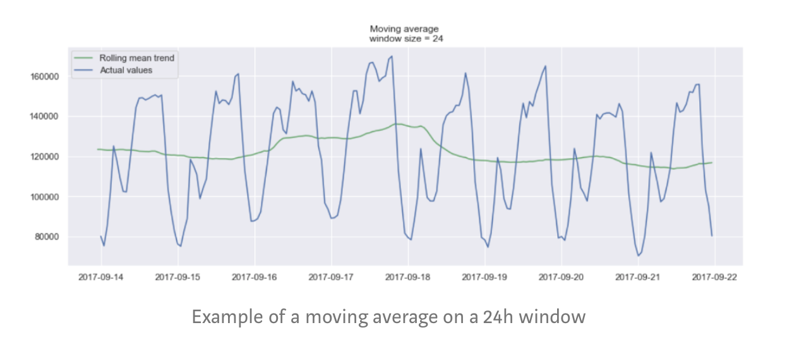

# Kaggle competition - time series

Assign: Esther Yang
Created On: Jul 16, 2020 7:33 PM
Status: Completed

### Learning Plan

- A: Replicate other M5 EDA
- B: Retail analytics course
- C: Consult people who have done it

### Questions:

- Problem of data structure: Date&Store&Department v.s. Product
    - inconvenience to merge based on date without cleaning up other variables(Store& Department)
    - inconvenience to plot based on date

### Seasonality effect

- **Level**: The average value in the series.
- **Trend**: The increasing or decreasing value in the series.
- **Seasonality**: The repeating short-term cycle in the series.
- **Noise**: The random variation in the series.

Additive Model: y(t) = Level + Trend + Seasonality + Noise

Multiplicative Model: y(t) = Level * Trend * Seasonality * Noise

## To learn

- interactive python

### **Autocorrelation**

Def: Informally, **autocorrelation** is the similarity between observations as a function of the time lag between them.


e.g. the 1st and the 24th have a high autocorrelation  → we will find similar value at every 24 unit of time → a hint for seasonality

### **Seasonality**

Def: **Seasonality** refers to periodic fluctuations. 

### **Stationarity**

**Stationarity** is an important characteristic of time series. A time series is said to be stationary if its statistical properties do not change over time. In other words, it has **constant mean and variance**, and covariance is independent of time. 


e.g. the mean and var do not vary over time in  the plot above 

**Test about stationary: Dickey-Fuller test**

- If it is, then *p >* 0, and the process is not stationary.
- Otherwise, *p =* 0, the null hypothesis is rejected, and the process is considered to be stationary.

### **Modelling time series**

There are many ways to model a time series in order to make predictions. Here, I will present:

- moving average
- exponential smoothing
- ARIMA

### Moving average

Def: This model simply states that the next observation is the mean of all past observations.

We can define a *window* to apply the moving average model to *smooth* the time series, and highlight different trends. 


### Exponential smoothing

Def: Exponential smoothing uses a similar logic to moving average, but this time, a different decreasing weight is assigned to each observations. 




0 < smoothing factor <1

x(t): 上一個實際值

y(t-1): 上一個的預測值


## Double exponential smoothing

- Holt-Winters double exponential smoothing

Again, the raw data sequence of observations is represented by {xt}, beginning at time t = 0. We use {st} to represent the smoothed value for time t, and {bt} is our best estimate of the trend at time t.

[https://wikimedia.org/api/rest_v1/media/math/render/svg/f3f9515f409cf8de156d8130db6cfab0b114890d](https://wikimedia.org/api/rest_v1/media/math/render/svg/f3f9515f409cf8de156d8130db6cfab0b114890d)

[https://wikimedia.org/api/rest_v1/media/math/render/svg/96dfbe119e8203037a0038facb88fd62bf7f5f4f](https://wikimedia.org/api/rest_v1/media/math/render/svg/96dfbe119e8203037a0038facb88fd62bf7f5f4f)

[The Complete Guide to Time Series Analysis and Forecasting](https://towardsdatascience.com/the-complete-guide-to-time-series-analysis-and-forecasting-70d476bfe775)

### Resources

[Time Series Forecasting-EDA, FE & Modelling📈](https://www.kaggle.com/anshuls235/time-series-forecasting-eda-fe-modelling#3.-Melting-the-data)

[M5 Competition : EDA + Models 📈](https://www.kaggle.com/tarunpaparaju/m5-competition-eda-models#Modeling-)

[M5 Forecasting Exhaustive EDA Beginner](https://www.kaggle.com/anirbansen3027/m5-forecasting-exhaustive-eda-beginner/notebook)

[7.1 Simple exponential smoothing | Forecasting: Principles and Practice](https://otexts.com/fpp2/ses.html)

[Statistical forecasting: notes on regression and time series analysis](https://people.duke.edu/~rnau/411home.htm)

## Downcasting for big dataset

Downcasting: downcasting the dataframes to reduce the amount of storage used by them and also to expidite the operations performed on them.

**Numerical Columns:**

Depending on your environment, pandas automatically creates int32, int64, float32 or float64 columns for numeric ones. If you know the min or max value of a column, you can use a subtype which is less memory consuming. You can also use an unsigned subtype if there is no negative value.

Here are the different subtypes you can use:

```
int8 / uint8
```

: consumes 1 byte of memory, range between -128/127 or 0/255

```
bool
```

: consumes 1 byte, true or false

```
float16 / int16 / uint16
```

: consumes 2 bytes of memory, range between -32768 and 32767 or 0/65535

```
float32 / int32 / uint32
```

: consumes 4 bytes of memory, range between -2147483648 and 2147483647

```
float64 / int64 / uint64
```

: consumes 8 bytes of memory

If one of your column has values between 1 and 10 for example, you will reduce the size of that column from 8 bytes per row to 1 byte, which is more than 85% memory saving on that column!

**Categorical Columns:** Pandas stores categorical columns as objects. One of the reason this storage is not optimal is that it creates a list of pointers to the memory address of each value of your column. For columns with low cardinality (the amount of unique values is lower than 50% of the count of these values), this can be optimized by forcing pandas to use a virtual mapping table where all unique values are mapped via an integer instead of a pointer. This is done using the category datatype.


### About Kaggle Competition: Kaggle private and public leadership board

Competition scoring and ranking are based on two leaderboards : public and private. These two leaderboards are created by randomly splitting the test dataset. Public leaderboard is based on a subset of 30% of observations in test dataset you are submitting while the private leaderboard is based on the remaining 70% of data. The private leaderboard remains secret until the end of the competititon. It will determine the final competition ranking!

So far, all your submissions are based on the public leaderboard dataset. Using it, you are receiving a feedback about your performance. It can tell you how good you model is and how it is generalizing on unseen data.

However, the final leaderboard (70% of test dataset) will determine final result. Before the end of competition ranking (Submissions dead line : 02 April 2019, 23:59), you will have to select your two favorite submissions. By default, Kaggle chooses the two submissions that have performed the best on public leaderboard. However you are free to select the two submissions you want.

Finally, these two submissions will result in the private leaderboard and so final ranking. In a Kaggle competition, the purpose of this division is to prevent people from winning by overfitting to the public leaderboard. Participants then are motivated to make sure their models will generalize well to the private leaderboard test set.

Therefore, your results on public and private leaderboard could be slightly different. There are multiple ways to explain this difference including :

- Making a lot of submissions on Kaggle can result in an overfitting situation on public leaderboard. When making dozens of submissions, you could "learn" some imperfection in dataset that would promote a configuration towards an other.
